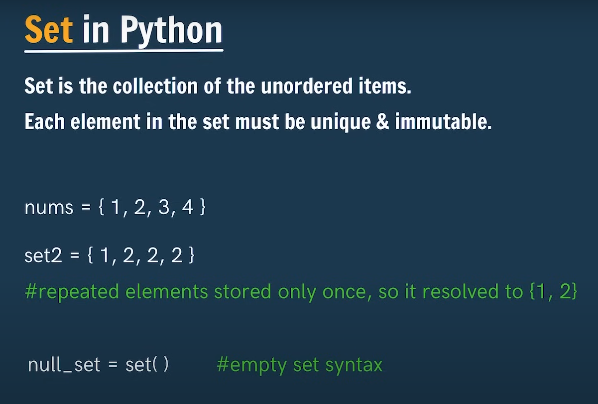

# Dictionary in Python
>[!NOTE]
> - Dictionaries are used to store data value in key:value pairs.   
> * They are unordered, mutable(changeable) & don't allow duplicate keys    
>  
>  
>  
>
># Set in Python
>  
>
># Set Method
>
> Sets element are immutable(non-changeable)but set is mutable(changeable)

